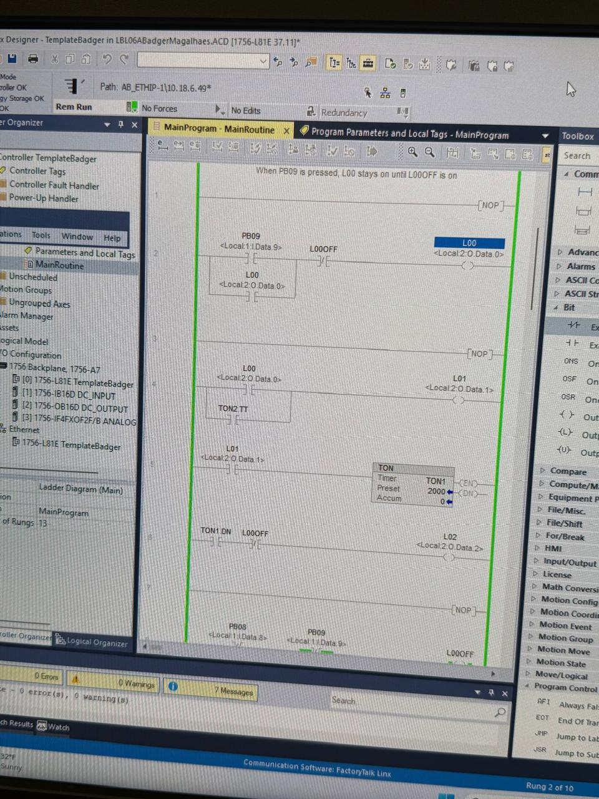
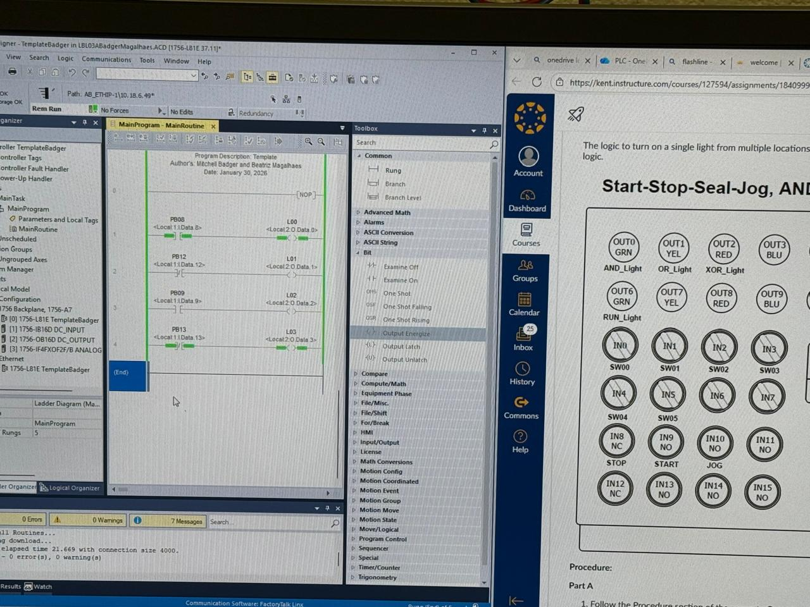
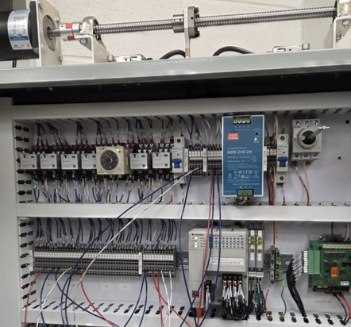

# beatrizdqmagalhaes.github.io
<!-- HEADER BANNER -->

  

<h1 align="center">Hi, I'm BEATRIZ MAGALHAES </h1>

<h3 align="center">
Mechatronics Engineering Student | CAD Designer | PLC Programmer 
</h3>

---

# About Me

I am an international Brazilian Kent State Mechatronics Engineering student focused on combining mechanical systems, electronics, automation, and programming to build intelligent engineering projects. My interests include: Robotics, Embedded Systems, PLC programming, Automation, and Circuit Design.

---

# Enginnering Portfolio

## CAD Projects 

Software Used:
Autodesk Inventor and
SolidWorks

  
### Description

In these projects, multiple engineering designs were created and analyzed using Autodesk Inventor and SolidWorks to develop accurate mechanical systems, manufacturing drawings, and structural simulations based on real-world engineering requirements.

CAD & Engineering Projects:
- Scooter assembly and product design project
- Machine frame design project
- Cable and harness routing projects
- Tube and pipe system design
- Sheet metal modeling projects
- Surfacing and frame generation projects
- Finite Element Analysis (FEA) bridge simulation project

Design & Development:
- Developed complete 3D models, 2D sketches, assemblies, and technical drawings with real-world dimensions
- Created GD&T annotations, balloon lists, bills of materials, and detailed manufacturing documentation
- Designed machine frames, tube and pipe systems, and cable harness routing for organized and manufacturable assemblies
- Produced animations and exploded assembly views to demonstrate component functionality and assembly processes
- Performed Finite Element Analysis on a bridge structure by applying real-life loading conditions, gravity, and vehicle weight simulations

Engineering Analysis:
- Evaluated stress distribution, strain, deformation, and safety factors using FEA tools
- Analyzed Von Mises stress and structural performance under realistic loading conditions
- Compared material properties and structural behavior to determine bridge strength, reliability, and safety
- Assessed whether designs could realistically withstand operational forces and environmental conditions

Challenges:
- Maintaining accurate dimensions and tolerances across complex assemblies
- Managing cable routing, frame constraints, and manufacturability within large CAD models
- Applying realistic loads and boundary conditions during FEA simulations
- Creating organized technical drawings and assemblies while ensuring all components functioned properly together

Solutions:
- Used parametric modeling techniques to improve design accuracy and simplify modifications
- Applied GD&T standards and engineering documentation practices for manufacturable designs
- Optimized frame layouts, cable management, and structural geometry to improve efficiency and organization
- Refined FEA simulations through iterative testing and material analysis to improve structural performance

Outcome:
- The projects resulted in fully developed CAD assemblies, manufacturing drawings, structural simulations, and engineering analyses that reflected real-world mechanical and structural design practices
- These experiences strengthened skills in CAD modeling, technical documentation, engineering analysis, FEA simulation, problem-solving, and mechanical system design.

### Project Images

  

## Programmable Logic Controllers 

### Description

In this project, industrial automation labs were completed using NEMA panels, Lightboxes, and PLC programming to solve real-world manufacturing and control system challenges. Using Studio 5000 by Rockwell Automation, programs were developed and tested with ladder logic, sequential function charts (SFC), and structured text to control automated sequences and simulated systems. The project involved analyzing engineering problems, planning programming approaches, wiring and programming control systems, troubleshooting errors, and testing performance under strict time constraints. One of the main challenges was quickly learning new concepts while applying previous knowledge to create functional and reliable automation systems. These projects strengthened skills in PLC programming, troubleshooting, teamwork, and industrial automation design.

### Project Images

  
  
  

## Guitar Tuner Project 

In this project, an electronic guitar tuner was designed and built to detect standard guitar frequencies and display the detected notes on a 7-segment display.

Components:
- LM324 operational amplifier
- Resistors
- Capacitors
- LED light bar
- Soldered Audio Jack
- 7-segment LED display
  
Equipment used in testing:
- Arduino MEGA
- Oscilloscope
- Multimeter

About the system:
- The system processed analog audio signals through RC filtering and operational amplifier stages
- Frequency analysis was performed using an Arduino MEGA with zero-crossing detection
- Circuit schematics were developed using Multisim and Fusion360
- Oscilloscopes and multimeters were used extensively to analyze waveforms and troubleshoot noise from Guitar

Challenges:
- Filtering harmonics and amplifying low-amplitude guitar signals accurately enough for stable frequency detection

Solution: 
- To improve system performance, the original voltage follower design was replaced with an inverting amplifier configuration, and software hysteresis was implemented to reduce signal instability and false triggering
- The final system successfully detected and displayed most guitar notes while improving waveform quality, signal stability, and overall tuner performance

Outcome:
- The project strengthened skills in circuit analysis, analog signal processing, troubleshooting, PCB and schematic design, and hardware-software integration

### Project Images

  
  

## Hovercraft Project

### Description
Hovercraft Project

In this project, a hovercraft was designed and built to navigate an obstacle course while transporting a golf ball under specific weight, cost, and material constraints.

Components & Materials:
- Foam base structure
- Balsa wood supports
- Propellers and motors
- Battery and electronic control systems
- CAD designs and sketches
- Custom-painted aesthetic components
  
Design & Development:
- Multiple hovercraft concepts were sketched and evaluated using Decision Matrix
- CAD models were developed to finalize dimensions, structure, and propulsion layout
- A three-propeller system was selected with one central fan for lift and two rear fans for propulsion and steering
- Gantt charts and team planning were used to organize manufacturing, testing, and presentations

System Features:
- The central propeller created the air cushion required for hovering
- Rear propellers controlled forward movement and turning
- The hovercraft was designed to balance maneuverability, stability, lightweight construction, and cost efficiency
- A custom “Mike Wazowski” aesthetic theme was integrated into the final design

Challenges:
- Maintaining stability while keeping the craft lightweight
- Preventing spinning and uneven weight distribution during movement
- Managing limited manufacturing experience and strict project constraints
- Organizing wiring and maintaining reliable propulsion performance during testing

Solutions:
- The team selected a compact three-propeller design to reduce weight and improve maneuverability
- Weight distribution and battery placement were adjusted to improve stability
- Multiple design concepts were compared using engineering decision matrices before selecting the final configuration
- Team collaboration, testing, and troubleshooting were used to refine the craft throughout development

Outcome:
- The final hovercraft successfully demonstrated hovering, maneuverability, and obstacle navigation capabilities
- The project strengthened skills in CAD design, teamwork, manufacturing, propulsion systems, troubleshooting, project management, and the engineering design process.

### Project Images

  

# Resume
[Download My Resume](Beatriz_Magalhaes_Resume.pdf)

# Contact Information

## Email
beatrizdqmagalhaes@gmail.com

## LinkedIn
https://linkedin.com/in/bqmagalhaes

## Portfolio Website
https://beatrizdqmagalhaes.github.io

---

# GitHub Stats

  

  

---

